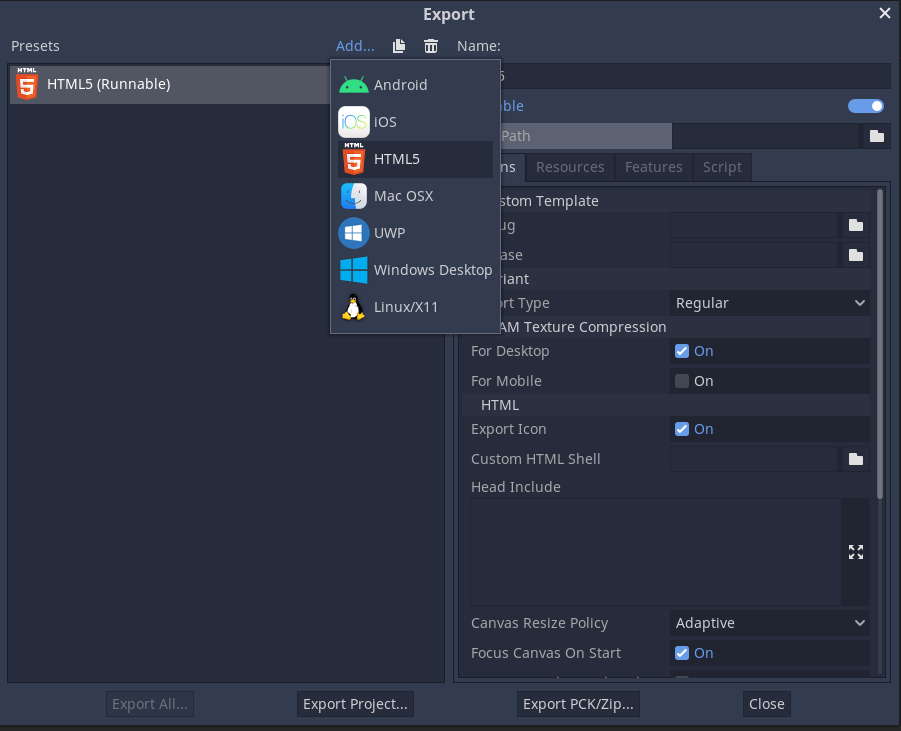

# Godot Project Template

Automatisk publisering av Godot prosjekter til GitHub via GitHub Pages. Demo: https://vaagenim.github.io/template_godot_publish/HTML5/Typing%20Demo.html

## Om spillet
Dette er en placeholder hvor du kan skrive litt om spillet du har laget, dersom du ønsker det. Gjerne slett teksten nedenfor og erstatt den med din egen.

## Oppsett GitHub
- `PROJECT_PATH` verdien i [.github/workflows/publish.yml](.github/workflows/publish.yml#L11) må endres til å samsvare med din _Godot_ prosjektmappe.
- _GitHub Pages_ må skrus på for at siden skal publiseres. Dette gjør du via [GitHub Settings -> Pages menyen](settings/pages). 
- Her velger du under `Build and Deployment -> Source: GitHub Actions`.

Det kan hende du må starte workflow runnen i GitHub på ny via [Actions](actions) siden. Når alt er konfigurert vil spillet automatisk oppdateres i GitHub Pages ved nye endringer.

Dersom du gjør GitHub prosjektet ditt offentlig, vil hvem som helst kunne besøke siden din, ellers er tilgangen begrenset.

## Oppsett Godot
- I Godot må du definere `Export Presets` (HTML5 er for web), uten dette vil det ikke være mulig å "bygge" prosjektet. 
- Alle Export Presets du definerer vil bli bygget og publisert via en GitHub Arbeidsflyt.

#### HTML5 Export Preset:

## Notat
Finere demo og bedre oppskrift på publisering kommer senere.
